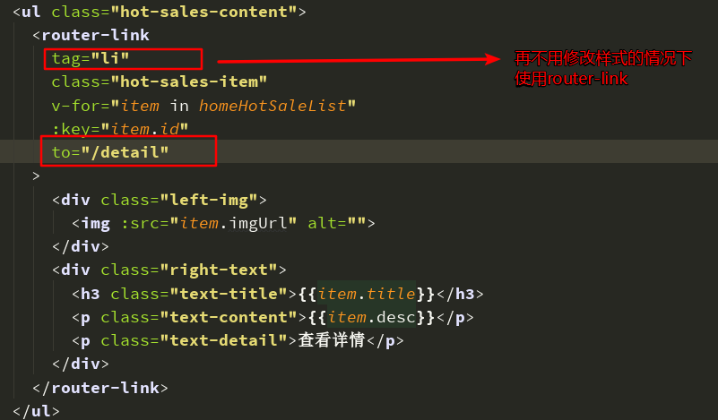
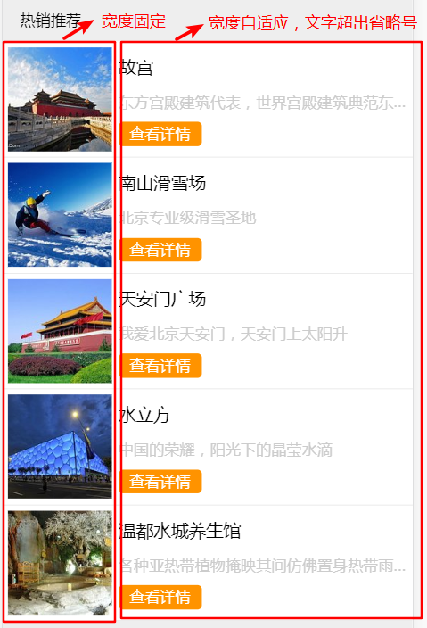
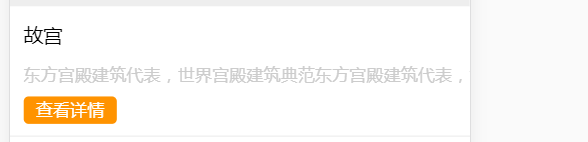
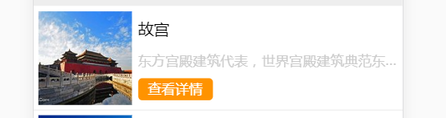
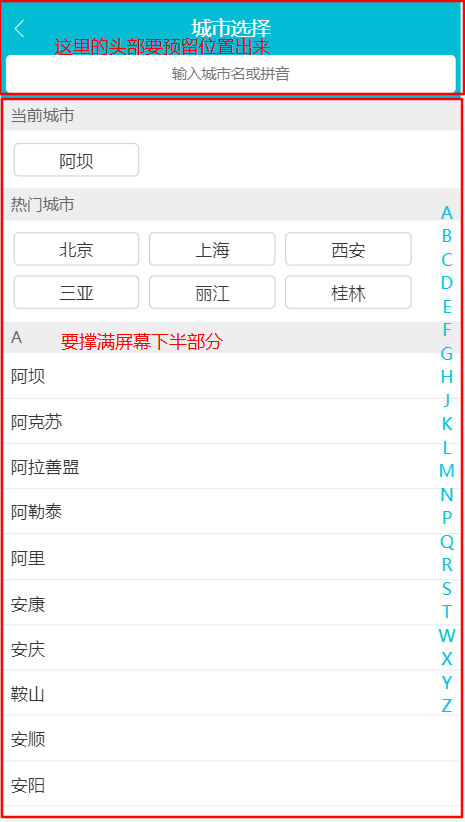
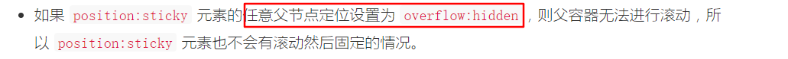

## 知识总结
### 一：通过`webpack`配置的别名来引入`less`文件
通过别名`webpack`配置的`aliase`引入会报错

原因：`css`文件会被用`css-loader`来处理，这里CSS`@import`后的字符串会被`css-loader`视为绝对路径解析，因为我们并没有添加`css-laoder`的`alise`,所以会报找不到`@`目录。

解决方法：
在引用路径的字符串最前面添加`~`符号  
```css
/* webpack将会以~符号作为前缀的路径视作依赖模块而去解析 */
@import '~/style/theme'
```

> 各类非js（`import``require`）直接引用静态资源，依赖相对路径加载问题，都可以用`~`完美解决

### 二：在父组件中改变子组件的样式
**注意：一个子组件的根节点会同时受其父组件的scoped css 和子组件的scoped css的影响**  

在使用到轮播组件`Vue-Awesome-Swiper`时，要改变轮播组件中轮播图片下方的小圆点样式  
  
由于这个样式是在`Vue-Awesome-Swiper`组件中书写的，当我们自己定义的组件的`<style>`标签添加了`scoped`属性时，CSS样式只针对当前组件的元素有效  

解决方法：
```css
/* 改变swiper组件中小圆点样式 */
& /deep/ .swiper-pagination-bullet-active {
  background-color: #fff;
}
```
在这里使用到了深度作用选择器,可以使`scoped`样式中的一个选择器作用的”更深“,可以影响到子组件。

由于`Sass`和`less`之类的预处理器无法正确解析`>>>`,使用`/deep/`操作符来代替`>>>`，作为`>>>`的一个别名来使用。

### 三：`router-link`的`tag`属性
  
通过`tag`属性，可以将`router-link`渲染成我们想要使用的`html`标签。否则由于`router-link`的`tag`属性默认为 "a",会有自带属性，从而破坏页面的布局  

这里是将`router-link`渲染成一个`li`标签的实际应用


### 四：`min-width`和`flex`结合使用
  
在详情页面的热销推荐模块，通过`flex`布局实现左侧图片定宽，右侧文字介绍内容自适应。但是当左侧文字内容没有超出时正常显示，超出时会出现如下情况  
  
这里为左侧盒子设置属性：`min-width:0`完美解决。  


### 五：定位`top=0;bottom=0;`的小技巧
通过定位元素(`absolute,fixed`)的`top`和`bottom`属性，可以很好的实现一些比较复杂的页面布局。这里以城市页面布局为例  
  
```css
.city-content {
  position: absolute;
  left: 0;
  top: 2.1067rem;
  bottom: 0;
}
```
上段代码通过`top:2.1067rem`为头部搜索框预留出了位置，通过`bottom:0`将下方剩余区域添充至满，实现头部固定，下方占满手机屏幕的布局。

这里的字母表通过`flex`布局结合`position:fixed`实现相对于城市列表内容垂直居中
```css
.city-letter {
  display: flex;
  align-items: center;
  position: fixed;
  right: 0.2133rem;
  top: 2.1067rem; 
  bottom: 0;
}
```
通过top和bottom将外部盒子占满整个城市列表区域，使用`align-items:center`属性将盒子内的字母`li`垂直居中显示  
  
### 六：城市页面功能实现
#### 1.屏幕滑动到对应字母开头的城市列表，右侧字母表激活
知识点：
* `Element.clientHeight`:返回元素节点的css宽度，只包括元素本身的宽度和`padding`,只对块级元素有效，如果有垂直滚动条，还要减去垂直滚动条的宽度

实现思路：  
1. 监听城市列表的滚动事件，实时获得滚动时的Y值
2. 将每个字母对应的城市列表的`DOM`高度放入一个数组中，要注意这里的初始位置是当前城市高度+热门城市高度。
3. 将滚动的Y值和高度数组项进行比较，一旦发现数组项中第一个大于Y值得元素时，停止循环，返回对应的索引值
```js
// 在computed中实时获取高度数组
calculateHeight() {
  let heightList = [];
  const currentCity = document.querySelector(".city-current");
  const hotCity = document.querySelector(".city-hot");
  let initHeight = currentCity.clientHeight + hotCity.clientHeight;
  const content = document.querySelectorAll(".city-content");
  for (let i = 0; i < content.length; i++) {
    heightList.push(initHeight);
    initHeight += content[i].clientHeight;
  }
  return heightList;
},
// 初始化better-scroll
initScroll() {
  this.scroll = new BScroll(this.$refs.wrapper, {
    // 必须传入该属性才能进行better-scroll滚动事件的监听，可以查看文档
    probeType: 3
  });
  // better-scroll 中的事件监听方式
  this.scroll.on("scroll", this.onScroll);
},
// 监听better-scroll的scroll事件
onScroll(pos) {
  if (this.timer) {
    clearTimeout(this.timer);
  }
  this.timer = setTimeout(() => {
    let y = -pos.y;
    for (let i = 0; i < this.calculateHeight.length; i++) {
      // 这里只是进行估值计算，否则可能导致页面滚动和右侧字母激活不一致
      if (y < Math.floor(this.calculateHeight[i] - 3)) {
        this.$emit("letterScroll", i - 2);
        return;
      } else if (
        y >
        this.calculateHeight[this.calculateHeight.length - 1] - 3
      ) {
        this.$emit("letterScroll", i-1);
      }
    }
  }, 16);
},
```
#### 2.在字母表滑动时，城市列表会跳转到滑动到的字母对应的列表
知识点：
* `touchstart`：被激活的触摸点
* `touchmove`：发生变化的触摸点
* `touchend`：消失的触摸点
* `changeTouches`:返回一个`TouchList`实例，成员是一组`Touch`实例对象，表示本次触摸事件的相关触摸点
* `offsetTop`: 返回当前元素相对于其最近的已定位的父元素的顶部的距离

实现思路：
1. 通过移动端触摸事件：`touchstart`,`touchmove`,`touchend`
2. 计算出第一个字母(A)距离顶部搜索栏的距离，通过事件对象获取到移动时的鼠标位置（距离页面左上角的x,y）
3. 计算鼠标位置到第一个字母顶部的距离进行下取整，之后除以每个字母的高度，获取到字母对应的li的索引
4. 通过索引获取到对应的字符，将字符传递到兄弟组件，进行列表切换
```js
// 在updated中进行数据初始化
updated() {
  const li = this.$refs["A"][0];
  this.liHeight = li.clientHeight;
  this.startHeight = li.offsetTop + this.cityHeaderHeight;
},
// 在methods定义移动端触摸事件
touchstart() {
  this.touchStatus = true;
},
touchmove(e) {
  // 优化点：代码不会立即执行，一直执行会一直清除定时器，直到停止touchmove事件时才会16毫秒后执行
  if (this.touchStatus) {
    if (this.timer) {
      clearTimeout(this.clearTimeout);
    }
    this.timer = setTimeout(() => {
      const touch = e.changedTouches[0];
      const index = Math.floor(
        (touch.clientY - this.startHeight) / this.liHeight
      );
      // 由于触摸停止的位置可以能不固定，所以touch.clientY可能会< "A"所在的位置，>"Z"所在的位置，导致index<0或者>=this.letterList.length
      // 如果index < 0 或者 index >= this.letterList.length的话，this.letterList
      if (index >= 0 && index < this.letterList.length)
        this.$emit("letterPosition", this.letterList[index]);
    }, 16);
  }
},
touchend() {
  this.touchStatus = false;
}
```

### 七: `Vue`组件`name`属性的作用
1. 组件递归调用
2. 在`keep-alive`中通过`name`取消缓存
3. 在`vue`的调试工具中能很好的显示组件的名字
4. 在代码出错的时候，更容易定位到错误位置
### 性能优化
1. 减少`DOM`操作  
   在进行DOM操作时，提前将要操作的节点对象赋值到变量，避免进行频繁的选择DOM元素
2. 函数防抖：对于一些频繁触发的事件(resize,scroll),一定在事件触发n秒后才执行
    ```js
    clearTimeout(timer)
    timer = setTimeout(() => {
      // 逻辑代码

    },20)
    ```
3. keep-alive

### 知识填坑
1.  粘性定位：`position:sticky`使用注意细节  
在城市列表页面，自己想通过粘性定位很简单的实现每一个城市对应的首字母的一个吸顶效果。但是有于在父容器中使用了`better-scroll`插件进，所以要为父元素设置`overflow:hidden`属性,导致吸顶效果无法使用。  
  

3. 如何判断一个对象是否为空?  
    1. obj.JSON.stringify() === "{}"
    2. Object.keys(obj).length === 0
    3. 通过`for...in`遍历，为真则为"非空数组"，否则为"空数组"
        ```js
        for(var i in obj) {
          return true;
        }
        return false; // 如果为空，返回false    
        ```
